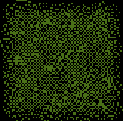

# AoC22
[Advent of Code 2022](https://adventofcode.com/2022) Python 3.11 solutions

## Diary

|&nbsp;|Challenge | Execution Time | Visualisation | Notes
|------|--------- | -------------- | ------------- | -----
|1a|Calorie Counting [🌐](https://adventofcode.com/2022/day/1)[💾](./day1.py) | 0ms |  | Find the elf with the most calorific food  __0h4m__
|1b|&nbsp; | 0ms |   | Find the 3 elves with the most calorific food  **04:49** elapsed time was good enough for rank **#1191** a mere 1091 ranks outside the points leaderboard so I'll sleep in tomorrow!  __<0h1m__
|2a|Rock Paper Scissors [🌐](https://adventofcode.com/2022/day/2)[💾](./day2.py) | 1ms |  play! | XYZ = rock paper scissors  __0h21m__
|2b|&nbsp; | 1ms |   play!| XYZ = lose draw win  __0h4m__
|3a|Rucksack Reorganization [🌐](https://adventofcode.com/2022/day/3)[💾](./day3.py) | 0ms |  | find the set intersection  __0h19m__
|3b|&nbsp; |1ms |   | intersections pt 2  __0h20m__
|4a|Camp Cleanup [🌐](https://adventofcode.com/2022/day/4)[💾](./day4.py) | 3ms |   elf 1 is red elf 2 is cyan overlaps are white | find the subsets  __0h7m__
|4b|&nbsp; | 3ms |   | and back to intersections  __0h2m__
|5a|Supply Stacks [🌐](https://adventofcode.com/2022/day/5)[💾](./day5.py) | 0ms |  | text parsing multiple info sources and array manipulation  __36 minutes__
|5b|&nbsp; | 0ms |   | tiny change to element ordering  __0h1m__
|6a|Tuning Trouble [🌐](https://adventofcode.com/2022/day/6)[💾](./day6.py) | 0ms |  | Walk a long string for first occurrence of n unique characters where n=4  __0h12m__
|6b|&nbsp; | 1ms |   | where n=14  __<0h1m__
|7a|No Space Left On Device [🌐](https://adventofcode.com/2022/day/7)[💾](./day7.py) | 0ms |  | Track folder sizes in a Linux-like file system  __0h49m__
|7b|&nbsp; | 0ms |   | Delete the right one to start the upgrade.  Will we see more of this Linux virtual computer later?  __0h12m__
|8a|Treetop Tree House [🌐](https://adventofcode.com/2022/day/8)[💾](./day8.py) | 17ms |  visible trees | find the local maximum from edges of a 2D array  __0h13m__
|8b|&nbsp; | 59ms |  tree house (white) | find the local maximums from each point in a 2D array - O(N2) alert!  __0h29m__
|9a|Rope Bridge [🌐](https://adventofcode.com/2022/day/9)[💾](./day9.py) | 7ms |  | overslept :( then massively overcomplicated the rope tail updater by using compound if-then-elses; replaced my original 2-knot head tail solution with generic version from part 2 with length 2  __0h40m__
|9b|&nbsp; | 32ms |   | stuck for ages debugging complicated tail updater; eventually replaced that with much simpler version and it worked then simplified everything else to end up looking quite pleasing, good for animation too!  __1h36m__
|10a|Cathode-Ray Tube [🌐](https://adventofcode.com/2022/day/10)[💾](./day10.py) | 0ms |  | a comprehension test in two parts with a suitably satisfying end and an opportunity to use the new case statement __0h21m__
|10b|&nbsp;| 0ms |   | hmm my code is all #s... a useful reminder that [["."]\*40]\*6 gives you 6 references to the same array!  __0h35m__
|11a|Monkey in the Middle [🌐](https://adventofcode.com/2022/day/11)[💾](./day11.py) | 1ms |  | easy enough to understand, slightly painful to parse, made easier especially in part 2 by monkeypatching my monkeys after creating them. Monkey business indeed!  __1h3m__
|11b|&nbsp;| 196ms |   | I tried it without the mentioned worry reduction strategy first of course as python can handle arbitrarily big integers, but it also takes an arbitrarily very long time, so strategies it is, thankfully the required strategy didn't involve caching monkey states and came to me quite quickly, no-one wants to watch this animation!  __0h16m__
|12a|Hill Climbing Algorithm [🌐](https://adventofcode.com/2022/day/12)[💾](./day12.py) | 22ms |  red=start, blue=target | The first breadth-first search problem with a twist in adjacent cell selection, find your way from the start to the top of the hill.   __0h59m__
|12b|&nbsp;| 17ms |  red=start, blue=target| this time find your way to ground level from the top, should have been trivial swapping start position and end condition but triggered a bug in my previous solution when path hit row 0 and confused me for a long while.  __0h46m__
|13a|Distress Signal [🌐](https://adventofcode.com/2022/day/13)[💾](./day13.py) | 10ms |  | fell into a bear trap; this looked like a simple flatten and native list compare problem so I thought my super small recursive flatten function would get my silver star, but the list exhaustion requirement meant I went back to the drawing board, threw out the flatten function (sent to utils.py) and hand-crafted a recursive list walker complete with print instrumentation to match the example commentary  __1h14m__
|13b|&nbsp; | 21ms |  | A lot easier than part 2 - python just needs a **\_\_lt\_\_** function in a class to sort objects so I created a very simple signal class and used the compare function from part 1 to **sorted()** all the signals, two indexes later and I was done   __0h12m__
|14a|Regolith Reservoir [🌐](https://adventofcode.com/2022/day/14)[💾](./day14.py) | 255ms |  | Thankfully I did some numpy refresher homework yesterday. the hardest part for me was probably building the map to start with __0h49m__
|14b|&nbsp;                                                                                 | __7.446s!__ |   | Got some low results for sand on part2 then remembered array[:,:] doesn't make a copy it's just a slice of the original so my part 2 was only showing new sand on top of the completed part 1.  changed the answer to count sand in final array instead of tracking sand poured in (and used array.copy() too!) __0h24m__
|15a|Beacon Exclusion Zone [🌐](https://adventofcode.com/2022/day/15)[💾](./day15.py) | __57.141s!!__ |  | brute force `O(N**2)` test each `(x,y)` for a fixed `y` value to see if it's not a beacon the trouble is one of the N values is a very big number; tried to save time by creating a lookup table of all known non-beacon locations but if that ever finished it would have been huge because of >`4e12` values in the real problem so in the end I needed to create a beacon class to test whether a given `(x,y)` was covered by any of the `23` beacons __1h43__
|15b|&nbsp;                                                                                 | __62.457s__ |   | considering the problem space was >`4e12` (x,y) coordinates, I was happy enough with my "smart" brute force search, I still iterated every row, but I only tested at most `(sensors**2)/2==265`) `x` positions per `4e6` row to keep `O(N**3)` close to `O(N**2)` __1h 19m__
|16a|Proboscidea Volcanium [🌐](https://adventofcode.com/2022/day/16)[💾](./day16.py) | __479ms__ |  | Started with simple? recursion to solve the example quite quickly but realized it wouldn't cut it for the real map, so went away and learned networkx graphing module that gave me easier A* search to reach each valve then optimized my recursive valve opener to jump directly through turns to valve rooms and return best solution found __7h10m__
|16b|&nbsp; | __110ms__ |   | I thought long and hard how I could run santa and elephant through simultaneously and settled on scheduler tracking santa and elephant firing recursion with valves permutations each time either reached a valve, postponed the work to the weekend though...  Then I saw some advice why not just send the elephant through with Santa's valves blocked and see what he could do? It worked! I'm not sure it would work with any layout but it did with mine! __>24h__ 😮
|17a|Pyroclastic Flow [🌐](https://adventofcode.com/2022/day/17)[💾](./day17.py) | 113ms |  | Ah.. Tetris! Wrote a game simulator and dropped in 2022 objects, read the board height and worked fairly easily. sprite collision by multiplying shape arrays by board slices of the same shape was a neat trick __2h15m__
|17b|&nbsp; | 197ms |  | drop 1 trillion blocks? OK let's see how long it takes to repeat itself... actually only just past the 2022 turns of part one, did the maths and was off by 4 on the example :( spent a very long time debugging and after dumping height on each turn realized that part 2 started with the wrong shape! I had forgot to reset the Shape.INDEX class variable to 0 before part 2.  I also spent a lot of time looking for repeating cycle using an unmodded Shape.INDEX value in the hash meaning it would have ran forever, as a "fix" I implemented a much smaller sliding window so I didn't have to search a huge array for what I thought was a massive repeat loop only to discover the ~2k loop size when I eventually fixed the hash, the sliding window at least makes the animation look better! __15h 9m__ probably 2h+ active...
|18a|Boiling Boulders [🌐](https://adventofcode.com/2022/day/18)[💾](./day18.py) | 18ms |  | A return to quick solutions!  __0h10m__🥳
|18b|&nbsp; | 33ms |   | This should have been quick too, but Arggh GIGO fail, implemented many algorithms that probably all worked but all gave different answers only to find when I inspected my array planes visually that some outside space was still marked as inside space.  I only went through my array marking outside positions once in one direction so never backfilled the ones which became outside when a later outside one was found, not a problem for the example, big problem for the real data 😥 Problem solved, I initially tried subtracting internal face count, but filling inside space with rock and getting part 1 to do the maths was much easier __2h40m__ 🤦
|19a| [🌐](https://adventofcode.com/2022/day/19)[💾](./day19.py) | 102s |  | Massively overengineered it by creating Robot classes when a 4 integer was fine for tracking robots, even then it was really slow. Optimized by stopping miner creation if inventory could create any miner or there were more miners than needed to create any new robot, this gave too low answer on example, implemented a full text description dumper for chosen solution to compare with example and the problem was in undocumented part 2.  Allowed 2 more robots in inventory for each miner.  It worked.  feels bad tbh it's more of a #worksforme than a generic solution __6h36m__
|19b|&nbsp; | 2831s |   | Part 1 should just work on more turns, the tree will get bigger, but eventually the miner cap will stop miner building so just gave it a go.  It also worked after a loong thinking time... there must be a better way... maybe make geode cracker creation the target instead of turn? __1h3m__ mostly watching it run...
|20a| [🌐](https://adventofcode.com/2022/day/20)[💾](./day20.py) | <!-- 0.0s --> |  |  
|20b|&nbsp;                                                                                 | <!-- 0.0s --> |   |  
|21a| [🌐](https://adventofcode.com/2022/day/21)[💾](./day21.py) | <!-- 0.0s --> |  |  
|21b|&nbsp;                                                                                 | <!-- 0.0s --> |   |  
|22a| [🌐](https://adventofcode.com/2022/day/22)[💾](./day22.py) | <!-- 0.0s --> |  |  
|22b|&nbsp;                                                                                 | <!-- 0.0s --> |   |  
|23a| [🌐](https://adventofcode.com/2022/day/23)[💾](./day23.py) | 2.58s |  Just simulated each step as per the instructions, as soon as I have negative indexes and dynamic array sizes I prefer to use sets of (x,y) points to array manipulation but this was obviously not the extent of the suggested optimisation|  __2h23m__
|23b|&nbsp; | **797s** |  | Easy to convert part1 to new exit condition but it takes *13 minutes* to simulate, there is clearly a **lot** of optimisation left undone here __21m__
|24a| [🌐](https://adventofcode.com/2022/day/24)[💾](./day24.py) | 478ms |  | Another breadth first search but with no seen position caching due to the dynamic nature of blizzards forutnately the board was crowded enough that the states didn't grow very much and the solution was a surprisingly small number of turns.  I decided to precalculate all the wind positions for each turn to speed up search, but as the solution was a low number I expect most remained unused.  I tracked winds in separate sets to ease turn updates but only compared with the combined winds __1h44m__
|24b|&nbsp; | 1.276s |   | Very quick as it was modular enough to refactor the bfs out of part 1 and pass it start, end and starting turn values to cheer up the dismayed elf __9m__
|25a| [🌐](https://adventofcode.com/2022/day/25)[💾](./day25.py) | <!-- 0.0s --> |  |  

## Examples!

I lost time on an early day by not testing the example code, it does save a bit of time if you're *sure*, but otherwise it's always wise.  I added a `USING_EXAMPLE` boolean to my library this year so if I launch the test with **any** parameter e.g. `py test10.py 2` it tests the example instead.  With a little support from utils.py it becomes almost free to test the example first.

# Reddit

https://www.reddit.com/r/adventofcode

Never really used it for AoC before but helped me see a new approach on a couple of notable occasions.

* Day 16-2 - Send the elephant in after Santa - worked a treat
* Day 18-2 - Fill in the air pockets with rock and let part 1 solve it

## Powershell

This year I am using a [powershell script](./input/download.ps1) to fetch my inputs, and open todays AoC22 puzzle triggered at 05:00:01 every morning (UK time) 🥱😴 or as soon as I log in 😊
