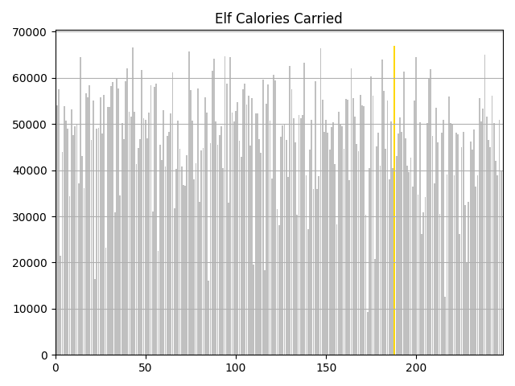

# AoC22
[Advent of Code 2022](https://adventofcode.com/2022) Python 3 solutions

## Diary

Challenge | Execution Time | Visualisation | Notes
--------- | -------------- | ------------- | -----
Day 1 Calorie Counting [🌐](https://adventofcode.com/2022/day/1)[💾](./day1.py) | 0.0s |      | Find the elf with the most calorific food
&nbsp; | 0.0s |   | Find the 3 elves with the most calorific food 

## Powershell

This year I am using a [powershell script](./input/download.ps1) to fetch my inputs, and open todays AoC22 puzzle triggered at 05:00:01 every morning (UK time) 🥱😴 or as soon as I log in 😊