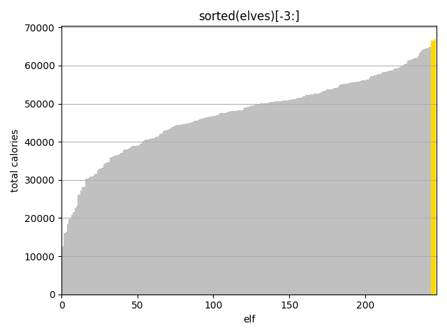

# AoC22
[Advent of Code 2022](https://adventofcode.com/2022) Python 3.11 solutions

## Diary

|&nbsp;|Challenge | Execution Time | Visualisation | Notes
|------|--------- | -------------- | ------------- | -----
|1a|Calorie Counting [🌐](https://adventofcode.com/2022/day/1)[💾](./day1.py) | 0ms |  | Find the elf with the most calorific food  __4 minutes__
|1b|&nbsp; | 0ms |   | Find the 3 elves with the most calorific food  **04:49** elapsed time was good enough for rank **#1191** a mere 1091 ranks outside the points leaderboard so I'll sleep in tomorrow!  __<1 minute__
|2a|Rock Paper Scissors [🌐](https://adventofcode.com/2022/day/2)[💾](./day2.py) | 1ms |  play! | XYZ = rock paper scissors  __21 minutes__
|2b|&nbsp; | 1ms |   play!| XYZ = lose draw win  __4 minutes__
|3a|Rucksack Reorganization [🌐](https://adventofcode.com/2022/day/3)[💾](./day3.py) | 0ms |  | find the set intersection  __19 minutes__
|3b|&nbsp; |1ms |   | intersections pt 2  __20 minutes__
|4a|Camp Cleanup [🌐](https://adventofcode.com/2022/day/4)[💾](./day4.py) | 3ms |   elf 1 is red elf 2 is cyan overlaps are white | find the subsets  __7 minutes__
|4b|&nbsp; | 3ms |   | and back to intersections  __2 minutes__
|5a|Supply Stacks [🌐](https://adventofcode.com/2022/day/5)[💾](./day5.py) | 0ms |  | text parsing multiple info sources and array manipulation  __36 minutes__
|5b|&nbsp; | 0ms |   | tiny change to element ordering  __1 minute__
|6a|Tuning Trouble [🌐](https://adventofcode.com/2022/day/6)[💾](./day6.py) | 0ms |  | Walk a long string for first occurrence of n unique characters where n=4  __12 minutes__
|6b|&nbsp; | 1ms |   | where n=14  __<1 minute__
|7a|No Space Left On Device [🌐](https://adventofcode.com/2022/day/7)[💾](./day7.py) | 0ms |  | Track folder sizes in a Linux-like file system  __49 minutes__
|7b|&nbsp; | 0ms |   | Delete the right one to start the upgrade.  Will we see more of this Linux virtual computer later?  __12 minutes__
|8a|Treetop Tree House [🌐](https://adventofcode.com/2022/day/8)[💾](./day8.py) | 17ms |  visible trees | find the local maximum from edges of a 2D array  __13 minutes__
|8b|&nbsp; | 59ms |  tree house (white) | find the local maximums from each point in a 2D array - O(N2) alert!  __29 minutes__
|9a|Rope Bridge [🌐](https://adventofcode.com/2022/day/9)[💾](./day9.py) | 7ms |  | overslept :( then massively overcomplicated the rope tail updater by using compound if-then-elses; replaced my original 2-knot head tail solution with generic version from part 2 with length 2  __40? minutes__
|9b|&nbsp; | 32ms |   | stuck for ages debugging complicated tail updater; eventually replaced that with much simpler version and it worked then simplified everything else to end up looking quite pleasing, good for animation too!  __96?? minutes__
|10a|Cathode-Ray Tube [🌐](https://adventofcode.com/2022/day/10)[💾](./day10.py) | 0ms |  | a comprehension test in two parts with a suitably satisfying end and an opportunity to use the new case statement __21 minutes__
|10b|&nbsp;| 0ms |   | hmm my code is all #s... a useful reminder that [["."]\*40]\*6 gives you 6 references to the same array!  __35 minutes__
|11a|Monkey in the Middle [🌐](https://adventofcode.com/2022/day/11)[💾](./day11.py) | 1ms |  | easy enough to understand, slightly painful to parse, made easier especially in part 2 by monkeypatching my monkeys after creating them. Monkey business indeed!  __63 minutes__
|11b|&nbsp;| 196ms |   | I tried it without the mentioned worry reduction strategy first of course as python can handle arbitrarily big integers, but it also takes an arbitrarily very long time, so strategies it is, thankfully the required strategy didn't involve caching monkey states and came to me quite quickly, no-one wants to watch this animation!  __16 minutes__
|12a|Hill Climbing Algorithm [🌐](https://adventofcode.com/2022/day/12)[💾](./day12.py) | 22ms |  red=start, blue=target | The first breadth-first search problem with a twist in adjacent cell selection, find your way from the start to the top of the hill.   __59 minutes__
|12b|&nbsp;| 17ms |  red=start, blue=target| this time find your way to ground level from the top, should have been trivial swapping start position and end condition but triggered a bug in my previous solution when path hit row 0 and confused me for a long while.  __46 minutes__
|13a|Distress Signal [🌐](https://adventofcode.com/2022/day/13)[💾](./day13.py) | 10ms |  | fell into a bear trap; this looked like a simple flatten and native list compare problem so I thought my super small recursive flatten function would get my silver star, but the list exhaustion requirement meant I went back to the drawing board, threw out the flatten function (sent to utils.py) and hand-crafted a recursive list walker complete with print instrumentation to match the example commentary  __74 minutes__
|13b|&nbsp; | 21ms |  | A lot easier than part 2 - python just needs a **\_\_lt\_\_** function in a class to sort objects so I created a very simple signal class and used the compare function from part 1 to **sorted()** all the signals, two indexes later and I was done   __12 minutes__
|14a|Regolith Reservoir [🌐](https://adventofcode.com/2022/day/14)[💾](./day14.py) | 255ms |  | Thankfully I did some numpy refresher homework yesterday. the hardest part for me was probably building the map to start with __49 minutes__
|14b|&nbsp;                                                                                 | 7.446s |   | Got some low results for sand on part2 then realised array[:,:] doesn't make a copy it's just a slice of the original so my part 2 was only showing new sand on top of the complete part 1.  changed the answer to cound sand in final array instead of tracking sand poured in (and used array.copy() too!) __24 minutes__
|15a| [🌐](https://adventofcode.com/2022/day/15)[💾](./day15.py) | <!-- 0.0s --> |  |  
|15b|&nbsp;                                                                                 | <!-- 0.0s --> |   |  
|16a| [🌐](https://adventofcode.com/2022/day/16)[💾](./day16.py) | <!-- 0.0s --> |  |  
|16b|&nbsp;                                                                                 | <!-- 0.0s --> |   |  
|17a| [🌐](https://adventofcode.com/2022/day/17)[💾](./day17.py) | <!-- 0.0s --> |  |  
|17b|&nbsp;                                                                                 | <!-- 0.0s --> |   |  
|18a| [🌐](https://adventofcode.com/2022/day/18)[💾](./day18.py) | <!-- 0.0s --> |  |  
|18b|&nbsp;                                                                                 | <!-- 0.0s --> |   |  
|19a| [🌐](https://adventofcode.com/2022/day/19)[💾](./day19.py) | <!-- 0.0s --> |  |  
|19b|&nbsp;                                                                                 | <!-- 0.0s --> |   |  
|20a| [🌐](https://adventofcode.com/2022/day/20)[💾](./day20.py) | <!-- 0.0s --> |  |  
|20b|&nbsp;                                                                                 | <!-- 0.0s --> |   |  
|21a| [🌐](https://adventofcode.com/2022/day/21)[💾](./day21.py) | <!-- 0.0s --> |  |  
|21b|&nbsp;                                                                                 | <!-- 0.0s --> |   |  
|22a| [🌐](https://adventofcode.com/2022/day/22)[💾](./day22.py) | <!-- 0.0s --> |  |  
|22b|&nbsp;                                                                                 | <!-- 0.0s --> |   |  
|23a| [🌐](https://adventofcode.com/2022/day/23)[💾](./day23.py) | <!-- 0.0s --> |  |  
|23b|&nbsp;                                                                                 | <!-- 0.0s --> |   |  
|24a| [🌐](https://adventofcode.com/2022/day/24)[💾](./day24.py) | <!-- 0.0s --> |  |  
|24b|&nbsp;                                                                                 | <!-- 0.0s --> |   |  
|25a| [🌐](https://adventofcode.com/2022/day/25)[💾](./day25.py) | <!-- 0.0s --> |  |  

## Powershell

This year I am using a [powershell script](./input/download.ps1) to fetch my inputs, and open todays AoC22 puzzle triggered at 05:00:01 every morning (UK time) 🥱😴 or as soon as I log in 😊
