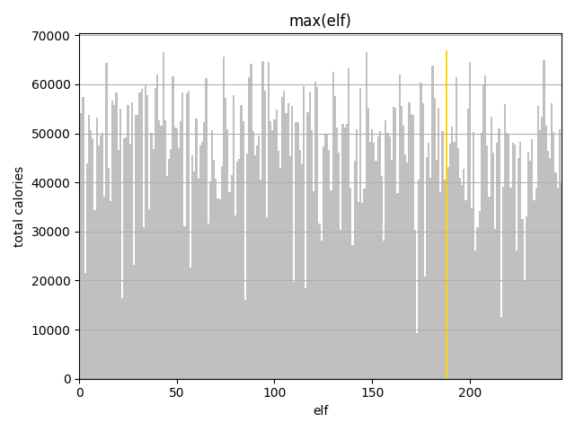

# AoC22
[Advent of Code 2022](https://adventofcode.com/2022) Python 3 solutions

## Diary

Challenge | Execution Time | Visualisation | Notes
--------- | -------------- | ------------- | -----
Day 1     Calorie Counting   [🌐](https://adventofcode.com/2022/day/1)[💾](./day1.py) | 0ms |  | Find the elf with the most calorific food
&nbsp;                                                                              | 0ms |   | Find the 3 elves with the most calorific food  **04:49** elapsed time was good enough for rank **#1191** a mere 1091 ranks outside the points leaderboard so I'll sleep in tomorrow!
Day 2     Rock Paper Scissors   [🌐](https://adventofcode.com/2022/day/2)[💾](./day2.py) | 1ms |  | XYZ = rock paper scissors
&nbsp;                                                                              | 1ms |   | XYZ = lose draw win
Day 3     Rucksack Reorganization  [🌐](https://adventofcode.com/2022/day/3)[💾](./day3.py) | 0ms |  | find the set intersection
&nbsp;                                                                              |1ms |   | intersections pt 2
Day 4   Camp Cleanup  [🌐](https://adventofcode.com/2022/day/4)[💾](./day4.py) | 3ms |  | find the subsets
&nbsp;                                                                              | 3ms |   | and back to intersections
Day 5   [🌐](https://adventofcode.com/2022/day/5)[💾](./day5.py) | <!-- 0.0s --> |  | 
&nbsp;                                                                              | <!-- 0.0s --> |   | 
Day 6   [🌐](https://adventofcode.com/2022/day/6)[💾](./day6.py) | <!-- 0.0s --> |  | 
&nbsp;                                                                              | <!-- 0.0s --> |   | 
Day 7   [🌐](https://adventofcode.com/2022/day/7)[💾](./day7.py) | <!-- 0.0s --> |  | 
&nbsp;                                                                              | <!-- 0.0s --> |   | 
Day 8   [🌐](https://adventofcode.com/2022/day/8)[💾](./day8.py) | <!-- 0.0s --> |  | 
&nbsp;                                                                              | <!-- 0.0s --> |   | 
Day 9   [🌐](https://adventofcode.com/2022/day/9)[💾](./day9.py) | <!-- 0.0s --> |  | 
&nbsp;                                                                              | <!-- 0.0s --> |   | 
Day 10   [🌐](https://adventofcode.com/2022/day/10)[💾](./day10.py) | <!-- 0.0s --> |  | 
&nbsp;                                                                                 | <!-- 0.0s --> |   | 
Day 11   [🌐](https://adventofcode.com/2022/day/11)[💾](./day11.py) | <!-- 0.0s --> |  | 
&nbsp;                                                                                 | <!-- 0.0s --> |   | 
Day 12   [🌐](https://adventofcode.com/2022/day/12)[💾](./day12.py) | <!-- 0.0s --> |  | 
&nbsp;                                                                                 | <!-- 0.0s --> |   | 
Day 13   [🌐](https://adventofcode.com/2022/day/13)[💾](./day13.py) | <!-- 0.0s --> |  | 
&nbsp;                                                                                 | <!-- 0.0s --> |   | 
Day 14   [🌐](https://adventofcode.com/2022/day/14)[💾](./day14.py) | <!-- 0.0s --> |  | 
&nbsp;                                                                                 | <!-- 0.0s --> |   | 
Day 15   [🌐](https://adventofcode.com/2022/day/15)[💾](./day15.py) | <!-- 0.0s --> |  | 
&nbsp;                                                                                 | <!-- 0.0s --> |   | 
Day 16   [🌐](https://adventofcode.com/2022/day/16)[💾](./day16.py) | <!-- 0.0s --> |  | 
&nbsp;                                                                                 | <!-- 0.0s --> |   | 
Day 17   [🌐](https://adventofcode.com/2022/day/17)[💾](./day17.py) | <!-- 0.0s --> |  | 
&nbsp;                                                                                 | <!-- 0.0s --> |   | 
Day 18   [🌐](https://adventofcode.com/2022/day/18)[💾](./day18.py) | <!-- 0.0s --> |  | 
&nbsp;                                                                                 | <!-- 0.0s --> |   | 
Day 19   [🌐](https://adventofcode.com/2022/day/19)[💾](./day19.py) | <!-- 0.0s --> |  | 
&nbsp;                                                                                 | <!-- 0.0s --> |   | 
Day 20   [🌐](https://adventofcode.com/2022/day/20)[💾](./day20.py) | <!-- 0.0s --> |  | 
&nbsp;                                                                                 | <!-- 0.0s --> |   | 
Day 21   [🌐](https://adventofcode.com/2022/day/21)[💾](./day21.py) | <!-- 0.0s --> |  | 
&nbsp;                                                                                 | <!-- 0.0s --> |   | 
Day 22   [🌐](https://adventofcode.com/2022/day/22)[💾](./day22.py) | <!-- 0.0s --> |  | 
&nbsp;                                                                                 | <!-- 0.0s --> |   | 
Day 23   [🌐](https://adventofcode.com/2022/day/23)[💾](./day23.py) | <!-- 0.0s --> |  | 
&nbsp;                                                                                 | <!-- 0.0s --> |   | 
Day 24   [🌐](https://adventofcode.com/2022/day/24)[💾](./day24.py) | <!-- 0.0s --> |  | 
&nbsp;                                                                                 | <!-- 0.0s --> |   | 
Day 25   [🌐](https://adventofcode.com/2022/day/25)[💾](./day25.py) | <!-- 0.0s --> |  | 
&nbsp;                                                                                 | <!-- 0.0s --> |   | 

## Powershell

This year I am using a [powershell script](./input/download.ps1) to fetch my inputs, and open todays AoC22 puzzle triggered at 05:00:01 every morning (UK time) 🥱😴 or as soon as I log in 😊
