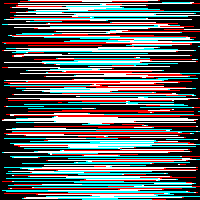
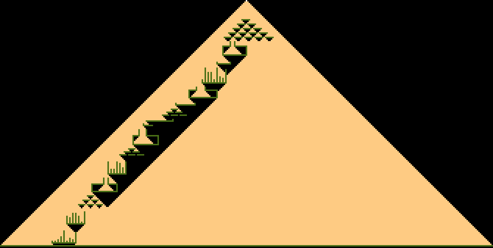

# AoC22
[Advent of Code 2022](https://adventofcode.com/2022) Python 3 solutions

## Diary

|&nbsp;|Challenge | Execution Time | Visualisation | Notes
|------|--------- | -------------- | ------------- | -----
|1a|Calorie Counting [🌐](https://adventofcode.com/2022/day/1)[💾](./day1.py) | 0ms |  | Find the elf with the most calorific food
|1b|&nbsp; | 0ms |   | Find the 3 elves with the most calorific food  **04:49** elapsed time was good enough for rank **#1191** a mere 1091 ranks outside the points leaderboard so I'll sleep in tomorrow!
|2a|Rock Paper Scissors [🌐](https://adventofcode.com/2022/day/2)[💾](./day2.py) | 1ms |  play! | XYZ = rock paper scissors
|2b|&nbsp; | 1ms |   play!| XYZ = lose draw win
|3a|Rucksack Reorganization [🌐](https://adventofcode.com/2022/day/3)[💾](./day3.py) | 0ms |  | find the set intersection
|3b|&nbsp; |1ms |   | intersections pt 2
|4a|Camp Cleanup [🌐](https://adventofcode.com/2022/day/4)[💾](./day4.py) | 3ms |   elf 1 is red elf 2 is cyan overlaps are white | find the subsets
|4b|&nbsp; | 3ms |   | and back to intersections
|5a|Supply Stacks [🌐](https://adventofcode.com/2022/day/5)[💾](./day5.py) | 0ms |  | text parsing multiple info sources and array manipulation
|5b|&nbsp; | 0ms |   | tiny change to element ordering
|6a|Tuning Trouble [🌐](https://adventofcode.com/2022/day/6)[💾](./day6.py) | 0ms |  | Walk a long string for first occurrence of n unique characters where n=4
|6b|&nbsp; | 1ms |   | where n=14
|7a|No Space Left On Device [🌐](https://adventofcode.com/2022/day/7)[💾](./day7.py) | 0ms |  | Track folder sizes in a Linux-like file system
|7b|&nbsp; | 0ms |   | Delete the right one to start the upgrade.  Will we see more of this Linux virtual computer later?
|8a|Treetop Tree House [🌐](https://adventofcode.com/2022/day/8)[💾](./day8.py) | 17ms |  visible trees | find the local maximum from edges of a 2D array
|8b|&nbsp; | 59ms |  tree house (white) | find the local maximums from each point in a 2D array - O(N2) alert!
|9a|Rope Bridge [🌐](https://adventofcode.com/2022/day/9)[💾](./day9.py) | 7ms |  | overslept :( then massively overcomplicated the rope tail updater by using compound if-then-elses; replaced my original 2-knot head tail solution with generic version from part 2 with length 2
|9b|&nbsp; | 32ms |   | stuck for ages debugging complicated tail updater; eventually replaced that with much simpler version and it worked then simplified everything else to end up looking quite pleasing, good for animation too!
|10a|Cathode-Ray Tube [🌐](https://adventofcode.com/2022/day/10)[💾](./day10.py) | 0ms |  | a comprehension test in two parts with asuitably satisfying end
|10b|&nbsp;| 0ms |   | hmm my code is all #s... a useful reminder that [["."]\*40]\*6 gives you 6 references to the same array!
|11a|[🌐](https://adventofcode.com/2022/day/11)[💾](./day11.py) | <!-- 0.0s --> |  | 
|11b|&nbsp;                                                                                 | <!-- 0.0s --> |   | 
|12a|[🌐](https://adventofcode.com/2022/day/12)[💾](./day12.py) | <!-- 0.0s --> |  | 
|12b|&nbsp;                                                                                 | <!-- 0.0s --> |   | 
|13a|[🌐](https://adventofcode.com/2022/day/13)[💾](./day13.py) | <!-- 0.0s --> |  | 
|13b|&nbsp;                                                                                 | <!-- 0.0s --> |   | 
|14a|[🌐](https://adventofcode.com/2022/day/14)[💾](./day14.py) | <!-- 0.0s --> |  | 
|14b|&nbsp;                                                                                 | <!-- 0.0s --> |   | 
|15a|[🌐](https://adventofcode.com/2022/day/15)[💾](./day15.py) | <!-- 0.0s --> |  | 
|15b|&nbsp;                                                                                 | <!-- 0.0s --> |   | 
|16a|[🌐](https://adventofcode.com/2022/day/16)[💾](./day16.py) | <!-- 0.0s --> |  | 
|16b|&nbsp;                                                                                 | <!-- 0.0s --> |   | 
|17a|[🌐](https://adventofcode.com/2022/day/17)[💾](./day17.py) | <!-- 0.0s --> |  | 
|17b|&nbsp;                                                                                 | <!-- 0.0s --> |   | 
|18a|[🌐](https://adventofcode.com/2022/day/18)[💾](./day18.py) | <!-- 0.0s --> |  | 
|18b|&nbsp;                                                                                 | <!-- 0.0s --> |   | 
|19a|[🌐](https://adventofcode.com/2022/day/19)[💾](./day19.py) | <!-- 0.0s --> |  | 
|19b|&nbsp;                                                                                 | <!-- 0.0s --> |   | 
|20a|[🌐](https://adventofcode.com/2022/day/20)[💾](./day20.py) | <!-- 0.0s --> |  | 
|20b|&nbsp;                                                                                 | <!-- 0.0s --> |   | 
|21a|[🌐](https://adventofcode.com/2022/day/21)[💾](./day21.py) | <!-- 0.0s --> |  | 
|21b|&nbsp;                                                                                 | <!-- 0.0s --> |   | 
|22a|[🌐](https://adventofcode.com/2022/day/22)[💾](./day22.py) | <!-- 0.0s --> |  | 
|22b|&nbsp;                                                                                 | <!-- 0.0s --> |   | 
|23a|[🌐](https://adventofcode.com/2022/day/23)[💾](./day23.py) | <!-- 0.0s --> |  | 
|23b|&nbsp;                                                                                 | <!-- 0.0s --> |   | 
|24a|[🌐](https://adventofcode.com/2022/day/24)[💾](./day24.py) | <!-- 0.0s --> |  | 
|24b|&nbsp;                                                                                 | <!-- 0.0s --> |   | 
|25a|[🌐](https://adventofcode.com/2022/day/25)[💾](./day25.py) | <!-- 0.0s --> |  | 

## Powershell

This year I am using a [powershell script](./input/download.ps1) to fetch my inputs, and open todays AoC22 puzzle triggered at 05:00:01 every morning (UK time) 🥱😴 or as soon as I log in 😊
